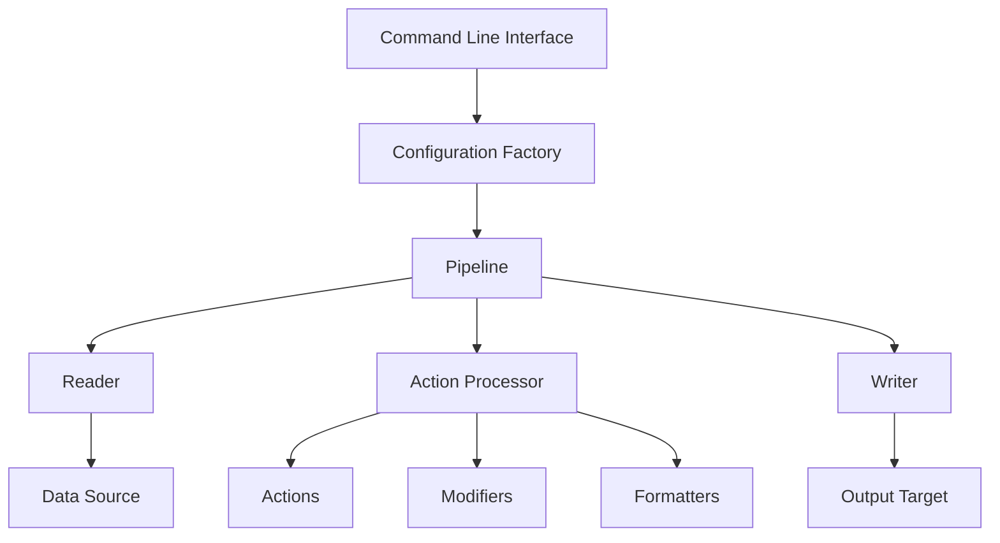
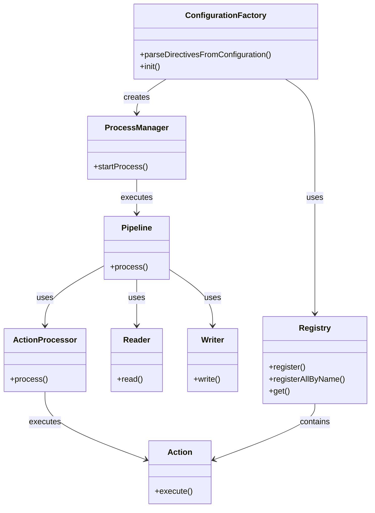
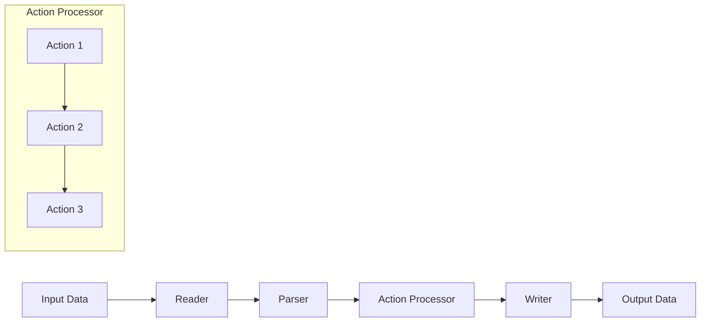
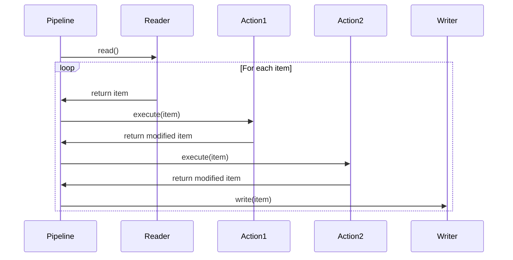
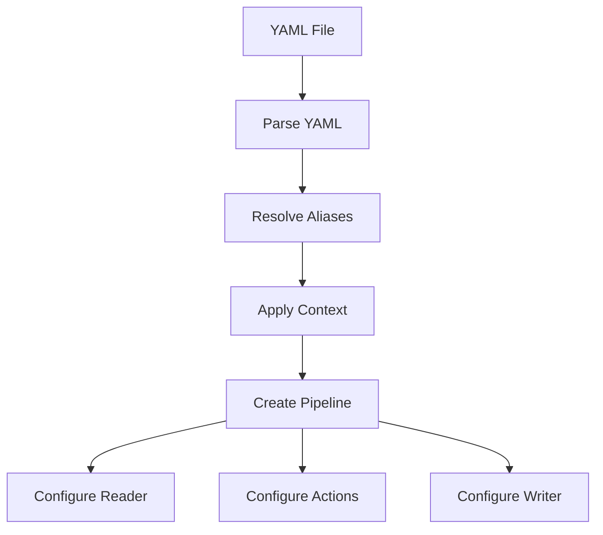

# Architecture Overview

## Introduction

The parsable-file-multi-tool is a powerful data transformation framework designed to process, transform, and validate data from various sources. This document provides a comprehensive overview of the system architecture, component relationships, data flow, and extension points.

## System Architecture

The system follows a modular architecture with clear separation of concerns, organized around the concept of data transformation pipelines. The architecture is designed to be extensible, allowing developers to add new components without modifying the core system.

### High-Level Architecture



### Core Components

1. **Command Line Interface (CLI)**: Entry point for executing transformations
2. **Configuration Factory**: Parses YAML configurations and initializes components
3. **Pipeline**: Orchestrates the data transformation process
4. **Readers**: Extract data from various sources (CSV, XML, JSON, API)
5. **Action Processor**: Applies transformation actions to data
6. **Writers**: Output transformed data to various formats
7. **Registries**: Manage available components (actions, modifiers, formatters)

## Component Relationships

### Component Hierarchy



### Registry System

The system uses a registry pattern to manage components:

1. **Action Registry**: Contains all available transformation actions
2. **Modifier Registry**: Contains text and data modifiers
3. **Format Registry**: Contains data format converters
4. **Converter Registry**: Contains data structure converters
5. **Source Registry**: Contains source data commands
6. **Factory Registry**: Contains component factories

Each registry allows components to be registered by name and retrieved when needed, enabling a plugin-like architecture.

## Data Flow

### Transformation Pipeline



### Data Processing Steps

1. **Reading**: Data is read from the source (file, API, etc.)
2. **Parsing**: Raw data is parsed into a structured format
3. **Transformation**: Actions are applied to transform the data
4. **Writing**: Transformed data is written to the output

### Item Processing

Each record (item) flows through the pipeline and is processed by each configured action:



## Extension Points

The system is designed to be extensible through several key extension points:

### 1. Custom Actions

Actions are the primary extension point, allowing developers to create new transformation operations:

```php
namespace Misery\Component\Action;

class CustomAction implements ActionInterface
{
    public const NAME = 'custom_action';
    
    public function execute(array $item, array $config): array
    {
        // Transform the item based on configuration
        return $item;
    }
}
```

### 2. Custom Readers and Writers

Extend the system to support new data sources and output formats:

```php
namespace Misery\Component\Reader;

class CustomReader implements ReaderInterface
{
    public function read(array $config): iterable
    {
        // Read data from custom source
        yield $item;
    }
}
```

### 3. Custom Modifiers and Formatters

Add new text processing and data formatting capabilities:

```php
namespace Misery\Component\Modifier;

class CustomModifier implements ModifierInterface
{
    public const NAME = 'custom_modifier';
    
    public function modify($value, array $options = [])
    {
        // Modify the value
        return $modifiedValue;
    }
}
```

### 4. Custom Converters

Create converters for specialized data formats:

```php
namespace Misery\Component\Converter;

class CustomConverter implements ConverterInterface
{
    public const NAME = 'custom_converter';
    
    public function convert(array $data): array
    {
        // Convert data structure
        return $convertedData;
    }
}
```

## Configuration System

### YAML Configuration Structure

The system uses YAML files for configuration, with a structure that defines:

1. **Context**: Global variables and settings
2. **Aliases**: File path shortcuts
3. **Pipeline**: The main transformation pipeline
   - **Input**: Reader configuration
   - **Actions**: Transformation steps
   - **Output**: Writer configuration

### Configuration Processing



## Memory Management

The system uses iterators and generators to process data in a memory-efficient way:

1. **Streaming Processing**: Items are processed one at a time
2. **Lazy Loading**: Data is loaded only when needed
3. **Resource Management**: Files and connections are properly closed

## Error Handling

The system includes several error handling mechanisms:

1. **Validation**: Input data is validated before processing
2. **Exception Handling**: Exceptions are caught and logged
3. **Debug Mode**: Detailed error information in debug mode
4. **Invalid Item Tracking**: Invalid items are tracked separately

## Performance Considerations

Key performance aspects of the architecture:

1. **Streaming Processing**: Minimizes memory usage
2. **Caching**: Optional caching for repeated operations
3. **Batch Processing**: Process data in configurable batch sizes
4. **Parallel Processing**: Support for multi-step parallel processing

## Security Considerations

The architecture addresses security through:

1. **Input Validation**: All input data is validated
2. **Secure Configuration**: Sensitive data can be stored in separate files
3. **Resource Isolation**: Limited access to system resources
4. **Error Handling**: Secure error handling that doesn't expose sensitive information

## Testing Architecture

The system supports comprehensive testing:

1. **Unit Tests**: Test individual components
2. **Integration Tests**: Test component interactions
3. **Functional Tests**: Test complete transformations
4. **Performance Tests**: Test system performance

## Conclusion

The parsable-file-multi-tool architecture provides a flexible, extensible framework for data transformation. By understanding the component relationships and data flow, developers can effectively extend the system with custom components and optimize transformations for their specific needs.

## Related Topics

- [Extension Development Guide](extending.md) - Creating custom extensions
- [Contributing Guidelines](contributing.md) - How to contribute to the project
- [API Reference](../reference/api.md) - Detailed API documentation